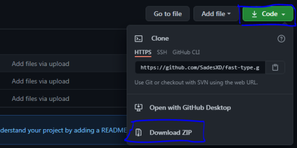
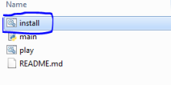
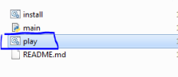

# Simple python alarm with voice

## Package required
- time
- pyttsx3 -> **[ pip install pyttsx3 ]**

## Usage
- 1. You need to install python first, docs -> [https://www.python.org/downloads/](https://www.python.org/downloads/), and then run the setup of python files
- 2. You can also install this app, switch `code -> download zip` and extract the rar to file and move that's file to 1 folder or to your folder

    

- 3. Click the `install.bat` for installation the required package

    

- 4. If you done, you can just click the file called `play.bat` or you can just click the python file ( `main.py` ) for using your python alarm

    

- 5. Enjoy 